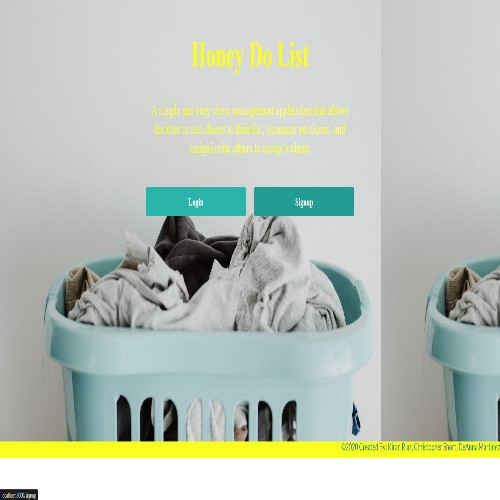

 # Honey Do List

 

  ## Table of Contents
[Description](#Description)     
  
[Languages and Technologies](#Languages-and-Technologies)
  
[Installation Instructions](#Installation-Instructions)
  
[Usage Instructions](#Usage-Instructions)
  
[License](#License)
  
[Contribution](#Contribution)
  
[Testing](#Testing)
  
[Acknowledgements](#Acknowledgements)
  
[Questions](#Questions)

  
  ## Description 
  ---
  An application designed to get the house chores done. Built with React, GraphQL, Node.js, Express.js, MongoDB and Redux. This application is also available offline with the help of a service worker. 
  
  ## Languages/Technologies
  ---
  HTML, CSS, JavaScript, MongoDB, Express, React, Node.js
  
  ## Installation Instructions
  ---
  n/a
  
  ## Usage Instructions
  ---
  go to https://honey-do-list.herokuapp.com/
  
  Navigate through the application to view previous projects and contact information.  

  At this time, we have been unable to get the application to deploy on Heroku.  Until then, please cole the repo at https://github.com/deannapi/honey-do-list and enter "npm run" in the CLI.  The application will run locally.  Sign up and start navigating the application.
  
  ## License
  ---
  
  
  ## Contribution
  ---
  
  ## Testing
  ---
  none
  
  ## Acknowledgements 
  ---
  none
  
  ## Questions
  ---

  
  ### Built by DeAnna Martinez, Kiran Riaz, and Chris Short 
  
